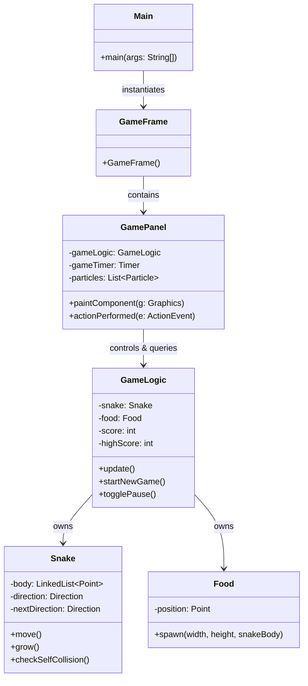

# Neon Snake Game Walkthrough

This document outlines the architecture, controls, and execution instructions for the custom Swing-based Snake game.

## 1. Class Structure and Responsibilities

The project is designed using Object-Oriented Programming (OOP) and Model-View-Controller (MVC) principles to separate the rendering/input logic from the underlying game state rules.

| Class File | Role | Primary Responsibilities |
| :--- | :--- | :--- |
| **`Main.java`** | Entry Point | Launches the game frame on the Swing Event Dispatch Thread (EDT). |
| **`GameFrame.java`** | Window Frame | Sets up the main window (`JFrame`), centers it, and binds the panel. |
| **`GamePanel.java`** | View/Controller | Handles graphics rendering (glows, gradients, particles) and keys. |
| **`GameLogic.java`** | Model | Manages scores, levels/difficulties, board updates, and collisions. |
| **`Snake.java`** | Entity Model | Manages body coordinates, turns, move ticks, and growth status. |
| **`Food.java`** | Entity Model | Tracks food position and generates random spawning coordinates. |

---

## 2. Architecture Diagram

The relationship between the classes is visualized below:



---

## 3. Game Controls

The game features responsive keyboard listeners supporting arrow keys, WASD, and numeric controls for settings.

| Key | Context | Action |
| :--- | :--- | :--- |
| **`SPACE`** | Start Screen | Starts the game session. |
| **`SPACE`** | Playing Game | Pauses / Resumes the gameplay. |
| **`ENTER` / `R`** | Game Over | Restarts a new session. |
| **`W` / `↑`** | Playing Game | Turns Snake UP. |
| **`S` / `↓`** | Playing Game | Turns Snake DOWN. |
| **`A` / `←`** | Playing Game | Turns Snake LEFT. |
| **`D` / `→`** | Playing Game | Turns Snake RIGHT. |
| **`1`** | Menu/Game Over | Selects **EASY** difficulty (150ms step delay). |
| **`2`** | Menu/Game Over | Selects **MEDIUM** difficulty (100ms step delay). |
| **`3`** | Menu/Game Over | Selects **HARD** difficulty (60ms step delay). |

---

## 4. UI/UX and Polish Features

- **Direction Buffer**: The snake buffers turns immediately to prevent 180-degree self-collisions when two opposite arrow keys are pressed in rapid succession within a single tick.
- **Neon Aesthetic**: Clean colors tailored after modern dark palettes:
  - Background is Slate-900 (`#0f172a`).
  - Snake is painted with a gradient running from Emerald Green (`#22c55e`) at the head to Cyan (`#06b6d4`) at the tail, complete with directional eyes.
  - Food is a pulsing Neon Rose (`#f43f5e`) dot with a translucent glow ring.
- **Particle System**: Fades out a burst of random-velocity neon pink particles upon eating food, making interactions feel responsive and visual.
- **Adjustable Difficulty**: Timer intervals dynamically adjust to provide easy, moderate, or fast gameplay speeds.

---

## 5. How to Compile and Run

1. Open your terminal in the project directory `/home/anusha/ui_snakegame/`.
2. Compile all files:
   ```bash
   javac *.java
   ```
3. Run the application:
   ```bash
   java Main
   ```
